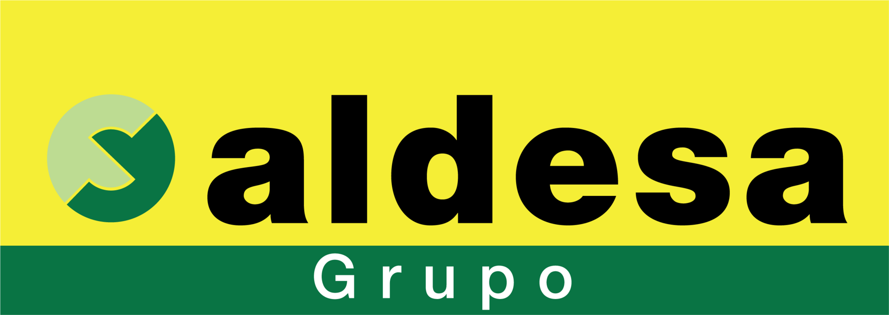

# Build Track GCP Data Platform

This repository contains the platform code behind Build Track on Google Cloud. It provisions the shared infrastructure with Terraform, validates and deploys changes with Cloud Build, stores Composer DAGs in Git, and provides the platform building blocks that Data Engineers use to ingest, orchestrate, transform, and publish data.

The functional data flow is:

`SAP Datasphere -> Cloud Storage landing bucket -> Pub/Sub/Eventarc -> Cloud Function -> Cloud Composer 3 -> Cloud Storage bronze parquet bucket -> Dataform / BigQuery -> Looker Studio Pro`

## Start here

### By topic

- [Architecture overview](docs/architecture/README.md)
- [Terraform and infrastructure](docs/terraform/README.md)
- [Make targets and local operation](docs/operations/make-targets.md)
- [Cloud Build and CI/CD](docs/cicd/cloud-build.md)
- [GitFlow and promotion model](docs/release/gitflow.md)

### By role

- DevOps / platform engineers can start with [Terraform bootstrap](docs/terraform/bootstrap.md), [environment model](docs/terraform/environments.md), [Make targets](docs/operations/make-targets.md), and [Cloud Build](docs/cicd/cloud-build.md).
- Data Engineers can start with the [Data Engineering guide](docs/data-engineering/README.md), [Dataform workflow](docs/data-engineering/dataform.md), and [DAGs and Composer](docs/data-engineering/dags-and-composer.md).

## Environment model

- `shared` lives in `data-buildtrack-dev` and holds the bootstrap and network foundation used by the non-production workloads.
- `pre` lives in `data-buildtrack-dev` and is the main non-production workload environment.
- `dev` also lives in `data-buildtrack-dev` and is an optional sandbox for manual DAG testing. It is enabled or disabled with a boolean in its `terraform.tfvars`.
- `pro` lives in `data-buildtrack-pro` and is the production environment.

The delivery model is simple:

- `develop` deploys to `data-buildtrack-dev`
- `main` deploys to `data-buildtrack-pro`
- production changes are promoted from `develop` to `main`, never developed directly on `main`

## Repository layout

- `cloudbuild/`: Cloud Build pipeline definitions and helper scripts for PR validation, Terraform apply flows, and DAG sync.
- `composer/`: Python package list used by managed Composer environments.
- `dags/`: DAG source code that is versioned in Git and synced to Composer after merge.
- `definitions/`: reserved location for Dataform project content managed by Data Engineers.
- `docs/`: repository documentation.
- `functions/`: Cloud Function source used by the landing-to-Composer event flow.
- `includes/`: shared JavaScript helpers for Dataform.
- `mk/`: Makefile internals, shared checks, and component-specific targets.
- `terraform/`: Terraform components, environment wiring, and reusable modules.
- `Makefile`: main entrypoint for local Terraform workflows.
- `workflow_settings.yaml`: Dataform workflow settings stored in the repository.

## What this repository manages

- Shared GCP platform resources such as networking, storage, Composer, Dataform infrastructure, governance, BI access, and CI/CD wiring.
- The Git-managed source of truth for Composer DAGs.
- The Git-managed source of truth for Dataform assets when the Data Engineering team chooses to work through the repository.

## What this repository does not manage

- Secret values themselves. Terraform creates the secret containers, but the values are uploaded manually.
- Business tables through Terraform. Terraform prepares the platform and datasets; Dataform is the layer expected to create and maintain business tables.
- Ad-hoc manual testing activity in the `dev` sandbox.

If you want the technical detail behind any of those statements, start from the [architecture overview](docs/architecture/README.md) and branch out from there.
